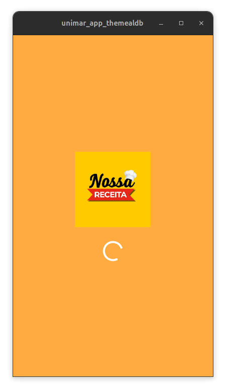
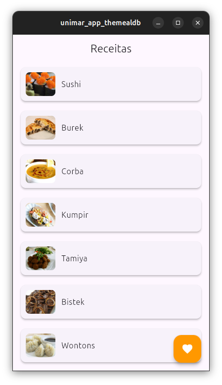
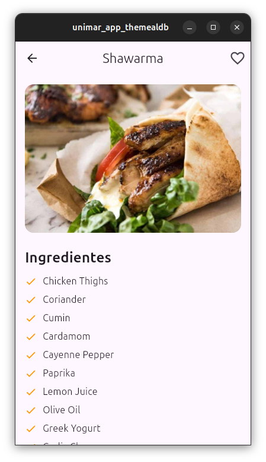
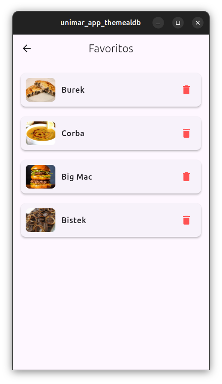

```markdown
# Projeto Flutter Unimar - PÓS FullStack

Aplicativo em Flutter/Dart para visualização e gerenciamento de receitas, incluindo funcionalidade de favoritar receitas e explorar detalhes completos.

**Aluno**: Fabiano Souza de Oliveira  
**RA**: 8093500

---

## Tecnologias Utilizadas

- **Flutter**: Framework UI para criação de aplicações multiplataforma.
- **Dart**: Linguagem de programação utilizada no desenvolvimento do aplicativo.
- **Provider**: Gerenciamento de estado para compartilhar dados entre widgets.
- **HTTP**: Biblioteca para requisições HTTP e consumo da API TheMealDB.
- **Shared Preferences**: Armazenamento de dados local para salvar favoritos.

---

## Instruções para Instalação e Configuração

---

1. **Clone o repositório**:
Para clonar o repositório e navegar até a pasta do projeto, execute:

```bash
git clone https://github.com/fsouzaweb/unimar-app-flutter-themeald && cd unimar-app-flutter-themeald
```
 
2. **Instale as dependências do projeto**:
Para instalar as dependências listadas no `pubspec.yaml`:

```bash
flutter pub get
```

3. **Configure o Ambiente Flutter**:
- **Certifique-se de ter o Flutter instalado** e configurado corretamente.
- Verifique se o dispositivo (emulador ou físico) está conectado para rodar a aplicação:

```bash
flutter doctor
```

4. **Executar o Projeto**:
   Para rodar o aplicativo em um dispositivo conectado ou emulador:

```bash
flutter run
```

---

## Estrutura do Projeto

- **`lib/controllers`**: Contém os controladores do projeto que gerenciam a lógica de negócio, incluindo chamadas de API e o gerenciamento de receitas.
- **`lib/models`**: Contém as classes de modelo que representam os dados de receita, incluindo nome, imagem, ingredientes e instruções.
- **`lib/views`**: Contém as telas do aplicativo, como a tela de listagem de receitas, detalhes, favoritos e splash screen.
- **`lib/widgets`**: (Opcional) Se houver widgets reutilizáveis, você pode colocá-los aqui para melhor organização.

---

## Funcionalidades do Aplicativo

### Splash Screen

- **Tela de Inicialização**  
  Ao abrir o aplicativo, o usuário vê uma tela de splash com o logo do aplicativo, exibida por alguns segundos antes da tela principal.

### Listagem de Receitas

- **Tela Principal**  
  Na tela principal, o usuário pode visualizar uma lista de receitas disponíveis, cada uma exibindo uma imagem e nome da receita.
  
- **Detalhes da Receita**  
  Ao clicar em uma receita, o usuário é levado à tela de detalhes, onde pode visualizar os ingredientes, instruções, e uma imagem da receita.

### Favoritar Receitas

- **Adicionar aos Favoritos**  
  Na tela de detalhes da receita, o usuário pode favoritar a receita clicando no ícone de coração. As receitas favoritas são salvas localmente com o uso de `Shared Preferences`.

- **Tela de Favoritos**  
  O usuário pode acessar suas receitas favoritas através do botão flutuante na tela de listagem de receitas.

---

## Instruções para Desenvolvimento

1. **Atualizar Dependências**:
   - Sempre que houver uma atualização no `pubspec.yaml`, execute:

   ```bash
   flutter pub get
   ```

2. **Gerenciamento de Estado com `Provider`**:
   - O `Provider` é utilizado para compartilhar informações entre diferentes partes do aplicativo, como a lista de receitas e os favoritos. Certifique-se de envolver o `MaterialApp` com o `ChangeNotifierProvider`.

3. **API TheMealDB**:
   - O aplicativo faz chamadas HTTP à API TheMealDB para obter informações sobre receitas.
   - **URL Base da API**: `https://www.themealdb.com/api/json/v1/1/`
   - Métodos usados incluem `GET` para buscar as receitas e detalhes específicos.

4. **Testar em Diferentes Dispositivos**:
   - Teste o aplicativo em diferentes tamanhos de tela (emuladores de celular e tablet) para garantir que o design seja responsivo.
   - Utilize `flutter emulators` para listar e iniciar emuladores.

---

## Dicas para Desenvolvimento

1. **Interface Responsiva**:
   - Utilize widgets como `Expanded`, `Flexible` e `MediaQuery` para garantir que o aplicativo seja exibido corretamente em diferentes tamanhos de tela.

2. **Utilizar Hot Reload**:
   - Durante o desenvolvimento, use `flutter run` e aproveite o **Hot Reload** para ver mudanças em tempo real.

3. **Verificar Erros com `flutter doctor`**:
   - Se estiver enfrentando problemas, execute `flutter doctor` para verificar a configuração do ambiente.

4. **Tratamento de Erros em Chamadas de API**:
   - Sempre trate possíveis erros ao fazer requisições HTTP, como falta de conexão, falhas de resposta da API, ou dados inesperados.

---

## Screenshots

**Tela de Splash (Loading)**  


**Tela Principal (Listagem de Receitas)**  


**Tela de Detalhes da Receita**  


**Tela de Favoritos**  


---

## Contato

Para dúvidas e sugestões, entre em contato com **Fabiano Souza de Oliveira** (RA: 8093500).
